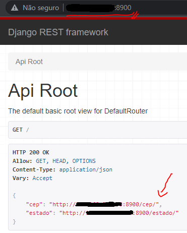
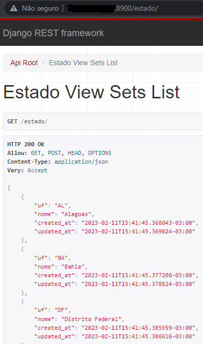
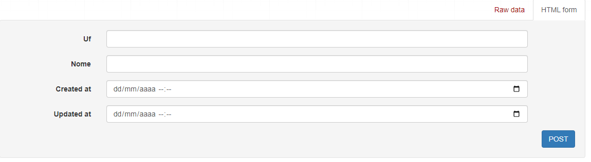
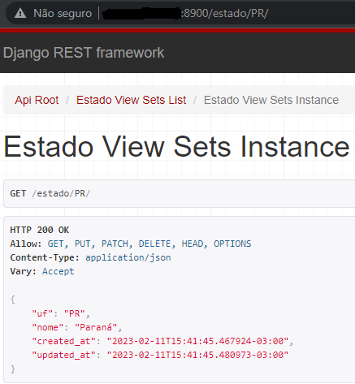
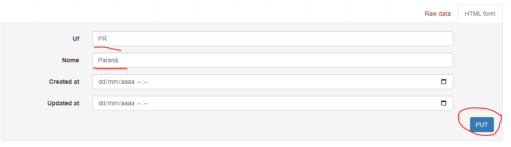
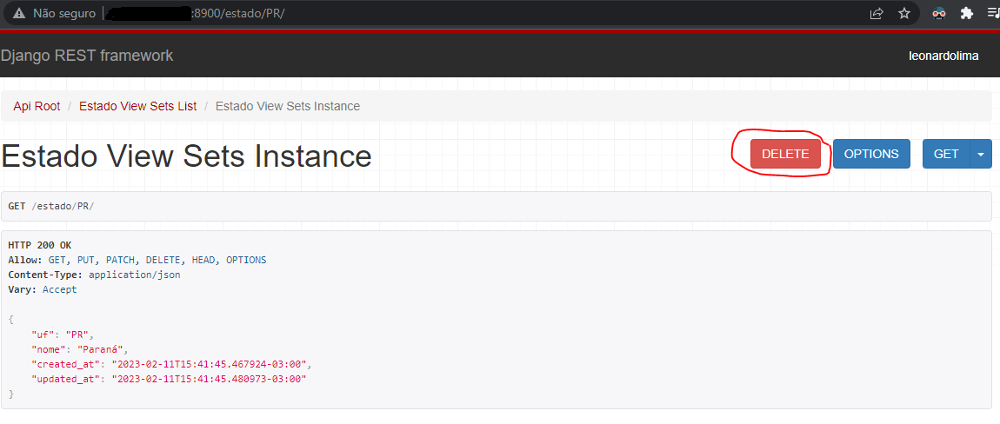
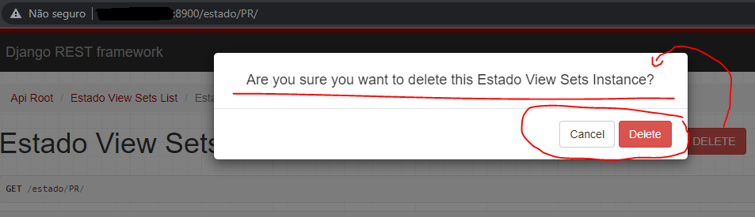
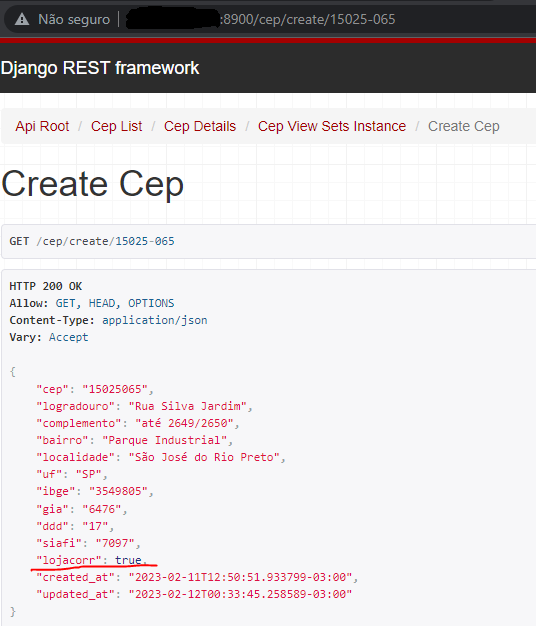
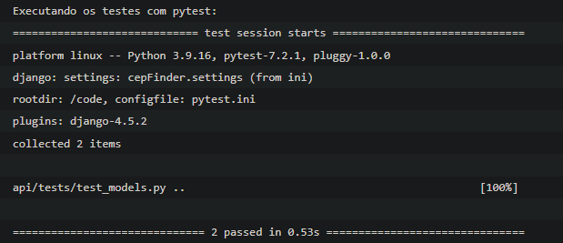

# cep-finder

### Objetivo

O objetivo do projeto era criar uma stack utilizando **docker compose** que contemplasse um projeto em **Python/Django**, **Django Rest Framework** e banco de dados **Postgres**.

- Consumir os dados da [API VIACEP](https://viacep.com.br/) e armazenando as buscas em banco, criando um CRUD para buscar, exibir, listar e editar os dados adquiridos.
- Criar um codetable com todos os estados em que a Lojacorr atua e se a busca por CEP trouxer um estado que está no codetable, criar uma flag no banco para identificar.
- Criar e documentar testes unitários utilizando [PYTEST](https://docs.pytest.org/en/7.2.x/).
- Alimentar o README.md do projeto com informações das stacks.

#### Como executar?

Para rodar a stack é necessário ter:

1. [Python](https://www.python.org/) instalado na sua máquina.
2. [Docker](https://docs.docker.com/) instalado na sua máquina.
3. Banco de dados [Postgres](https://www.postgresql.org/docs/).
4. Precisa criar uma base de dados no seu banco [Postgres](https://www.postgresql.org/docs/) e inserir as informações no arquivo `docker-compose.yml`:
```
...
db-postgres-cepfinder:
    image: postgres
    environment:
    POSTGRES_USER: <usuario_postegrs>
    POSTGRES_PASSWORD: <senha>
    POSTGRES_DB: <database>
...
```
5. Alterar o parâmetro `ALLOWED_HOSTS` no arquivo `cepFinder/settings.py`. Era usado um IP interno, talvez você queira rodar no seu `localhost`:
```
ALLOWED_HOSTS = ['localhost']
```
6. Executar o comando para subir os serviços:
```
docker compose up -d --build
```
#### API endpoints:

##### Estado:
| Método   |      Endpoint      |  Descrição |
|----------|:-------------:|------:|
| GET | /estado | Acesso à todos os Estados cadastrados(Estados List).
| GET | /estado/{uf} | Consulta de dados de um estado específico(View Sets Instance).
##### Cep:
| Método   |      Endpoint      |  Descrição |
|----------|:-------------:|------:|
| GET | /cep | Acesso à todos os Ceps cadastrados(Ceps List).
| GET | /cep/{cep} | Consulta de dados de um cep específico(View Sets Instance).
| POST | /cep/create/{cep} | Acessa a [API VIACEP](https://viacep.com.br/), caso o resultado seja positivo cadastra na tabela CEP.

#### Funções específicas da aplicação:
Abaixo seguem algumas funções específicas da aplicação, que representam as regras de negócio estabelecidas no objetivo deste projeto.
- Na inserção ou atualização de qualquer registro na tabela **Cep**, sempre é verificado antes se não existe algum registro na tabela **Estado** com a mesma **UF**, para definir a flag `lojacorr=True`.
- Quando um registro na tabela **Estado** é removido, também são atualizados os registros na tabela **Cep** que possuem a mesma **UF**, para atualizar a flag `lojacorr=False`.
- Caso a execução do `POST | /cep/create/{cep}` tenha retorno negativo, uma mensagem de erro é apresentada e nenhum registro é feito na tabela **Cep**.
- Você pode executar o `POST | /cep/create/{cep}` e `GET | /cep/{cep}` com ou sem hífen no CEP, dessa forma, a execução dos endpoints tem sempre o mesmo resultado para os CEPs: `15025065` e `15025-065`.
- Caso o usuário tente cadastrar um registro na tabela **Cep**, utilizando a função `POST | /cep/create/{cep}` mas o CEP já exista nos registros da tabela, esse registro é atualizado conforme a resposta da [API VIACEP](https://viacep.com.br/).

#### Como interagir com a aplicação?

1. Após a execução da stack no passo anterior, você poderá acessar a URL do projeto em execução no seu browser preferido e irá visualizar nossas rotas **default** da aplicação:



2. Podemos acessar qualquer uma das URLs para as nossas **viewsets** de cada uma das **models** do projeto. Por exemplo, acessando `/estado` temos a listagem de todas os registros da tabela **Estado**:


3. Nas páginas **viewsets** também temos os campos disponíveis para a criação de registros nas tabelas. Exemplo em:`/estado`:

Basta preencher os dados do formulário corretamente e enviar pelo botão **Post**, para inserir um registro na tabela.

4. Para acessar a visualização de um registro específico, basta inserirmos na URL da página, como parâmetro, desta forma: `/<viewset>/<primary_key>`. Exemplo: `estado/PR`:


5. Acessando uma **viewset instance**, temos também acesso às funções de **UPDATE** e **DELETE** daquele registro específico. No caso do **UPDATE** basta atualizar os campos que estão livres para edição no final da página e clicar em **PUT**, seu registro será atualizado. Exemplo: `estado/PR`:


6. Para realizar a exclusão de um registro, podemos utilizar a **viewset instance** do registro que queremos remover da tabela. Clicando em **DELETE** será apresentado uma tela de confirmação para validar a execução do comando. Exemplo: `estado/PR`: 



7. Temos uma pequena diferença na maneira como realizamos o registro de novos itens na nossa tabela **Cep**. Como ela precisa fazer uma requisição na [API VIACEP](https://viacep.com.br/) e validar se o CEP existe na sua base antes de inserir o registro, precisei modificar a forma da função create. A função aceita registros por sua **viewset** também, mas para de fato puxar os dados da [API VIACEP](https://viacep.com.br/) e executar a função, você precisa colocar os dados na URL do seu navegador. Desta forma: `/cep/create/<cep_para_inserção>`. Vamos aplicar o exemplo: `/cep/create/15025-065`. No exemplo, como o CEP cadastrado pertence a uma UF em que a Lojacorr atua, a flag `lojacorr` é apresentada como `true` no registro: 


#### Como o projeto foi estruturado?

##### Banco de dados Postgres

Primeiro eu criei uma base de dados bem simples para que o projeto Django pudesse utilizar. Fazia um tempo que não trabalhava com Postgres, então tive que reaprender alguns conceitos. Instalei no meu Debian e criei uma database.

##### Django Rest Framework

No meu repositório do projeto criei uma `venv` do python para controlar as dependências específicas do meu projeto:

```
python3 -m venv venv
```

Ativei a `venv` através do comando:

```
source venv/bin/activate
```

Instalei as dependências do **Python/Django** e do **Django Rest Framwork**:

```
pip install django
pip install djangorestframework
```

Depois criei o projeto **Django Rest Framework** através do comando:

```
django-admin startproject cepFinder
```

Logo em seguida criei uma API para gerenciar minhas **models** e funções que seriam criadas:

```
django-admin startapp api
```

##### Docker Compose

Após isso já era possível rodar a base do projeto. Então parti para criação do **docker compose**, que criaria os três serviços necessários para nossa aplicação:

- **db-postegres**. Serviço responsável pela execução da base de dados, possibilitando o registro dos outros serviços.
- **django**. Serviço em **Python/Django**, responsável pela execução das funções da aplicação.
- **run-script**. Serviço responsável por chamar uma função via **_bash_** que popula a tabela **Estado**, com todos os estados em que a Lojacorr atua, com base nas [Unidades pelo Brasil](https://redelojacorr.com.br/unidades/). Também executa os testes a aplicação [PYTEST](https://docs.pytest.org/en/7.2.x/).

Os serviços são co-dependentes, por isso adicionei a opção **depends_on** no `docker-compose.yml`, para que os serviços subam na ordem correta.

```docker-compose.yml
version: '3'
services:
  db-postgres-cepfinder:
    image: postgres
    environment:
      POSTGRES_USER: postgres
      POSTGRES_PASSWORD: postgres
      POSTGRES_DB: postgres
  django-cepfinder:
    build: .
    command: python manage.py runserver 0.0.0.0:8900
    volumes:
      - .:/code
    ports:
      - "8900:8900"
    depends_on:
      - db-postgres-cepfinder
  run-script-cepfinder:
    build: .
    command: sh run_script.sh
    volumes:
      - .:/code
    depends_on:
      - django-cepfinder
```

##### Populando a tabela Estado:

Para popular os dados da tabela **Estado** sempre que a stack sobe, eu configurei um script utilizando a biblioteca `django-extensions`. O serviço `run-script-cepfinder` é responsável por rodar um comando via **_bash_** que chama a execução do script, sempre após todos os outros serviços estarem no ar.

1. Instalei a biblioteca `django-extensions` do **Python**:

```
pip install django-extensions
```

2. Configurei um script para popular a tabela **Estado**. Disponível para visualização em: `api/scripts/populate_estados.py`.
3. Criei o arquivo **_bash_** que chama a execução do script. Disponível para visualização em: `./run_script.sh`.

##### Executando testes(PYTEST):
Foram criados testes unitários para as models, testando as regras de negócio que existem no contexto da aplicação.
- Quando a stack sobe, o serviço `run-script-cepfinder`, executa o comando `pytest`, no terminal do container, onde é possível verificar se os testes unitários foram positivos ou negativos em relação as regras de negócio. Basta acessar os logs do `compose`, com o comando `docker compose logs` que você poderá visualizar os retornos da função de teste, conforme a imagem abaixo:

- Mas você também pode executar os testes em seu próprio terminal, para poder visualizar a execução em tempo real:
  1. Acesse a pasta do projeto.
  2. Crie uma `venv` local com o comando `python3 -m venv venv`
  3. Ative a sua `venv` com o comando `source venv/bin/activate`
  4. Instale as dependências do projeto no seu ambiente virtual: `pip install -r requirements.txt`
  5. Execute o comando `pytest` que roda os testes unitários e você poderá ver no seu terminal a execução dos testes criados em `api/tests/test_models.py`
